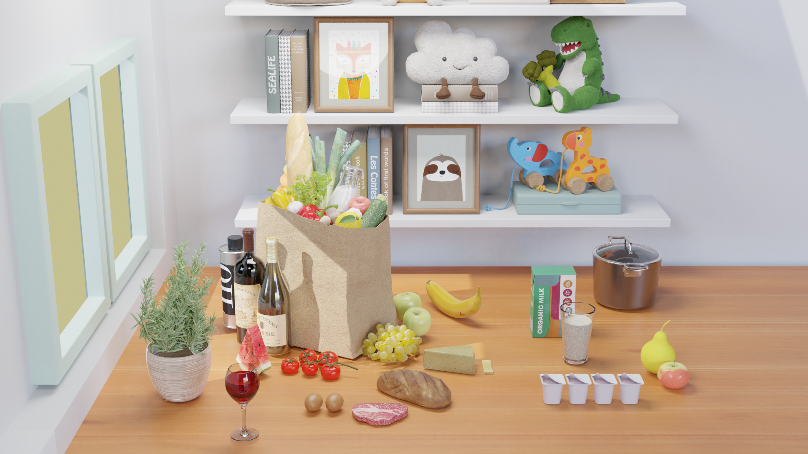

# LoRA Dataset Generation

This is the code used to generate the LoRA Dataset. 

You can use this code to generate complex logical questions and related images, like this:


<div align="center">
  
</div>

**Q:** If we do not have milk, is there another dairy product that does not necessarily contain fat but is rich in protein that can be subsituted for breakfast? <br>
**A:** Yogurt

**Q:**  Can we use the food between eggs and bread to make a meal for vegetarians? <br>
**A:**  No


## Step 1: Constructing Ontology

First, we construct a knowledge base by using Owlready2.  
```bash
cd ontology
Ontology_LoRA_KnowledgeBase.ipynb ->Run All
```


## Step 2: Generating Questions


Next we generate questions based on the ontology and logical operators. 
You can generate logical questions with 2 logical operators and 3 logical operators. 

You can generate basic logical questions by using:

```bash
cd question_generation
basic_logic_questions_generation.ipynb -> Run All
```

The detailed steps can be found in the `basic_logic_questions_generation.ipynb` file. 

More complex logical reasoning questions are generated by using:

```bash
cd question_generation
complex_reasoning_questions_generation.ipynb -> Run All
```
The detailed steps can be found in the `complex_reasoning_questions_generation.ipynb` file. 


## Step 3: Generating Answers

The answers are batch generated by using SparQL_query algorithm. 

The algorithm can be found here: 
```bash
cd answer_generation
SparQL_query.ipynb
```

To generate the answers, run:
```bash
cd answer_generation
answer_generation.ipynb -> Run All
```
The details can be found in the `answer_generation.ipynb` file. 


## Step 4: Generating Images

The images are generated based on answers and noise objects. Each image contains the answers objects and the noise objects. We use Blender script to generate the realistic kitchen scene. 

Firstly, install blender v2.93. 

Secondly, you need to generate visible_objects.csv file by using: 
```bash
cd answer_generation
answer_generation.ipynb -> Run All
```
The generated visible objects file are saved in the folder: 
```bash
cd image_generation
logic2_and_visible.csv
```

You can choose different blender background. The blender background file is `Vqa_Background_1.blend`. We provided four kitchen background scenarios in the file `image_generation/blender_background/Vqa_Backgrounds_Full.blend`. 

You can then render some images by using:

```bash
cd image_generation
blender Vqa_Background_1.blend --background --python image_generation.py
```
